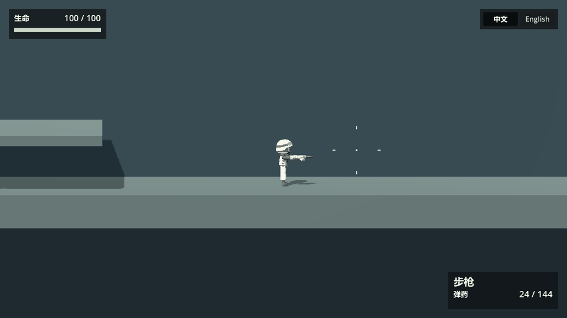
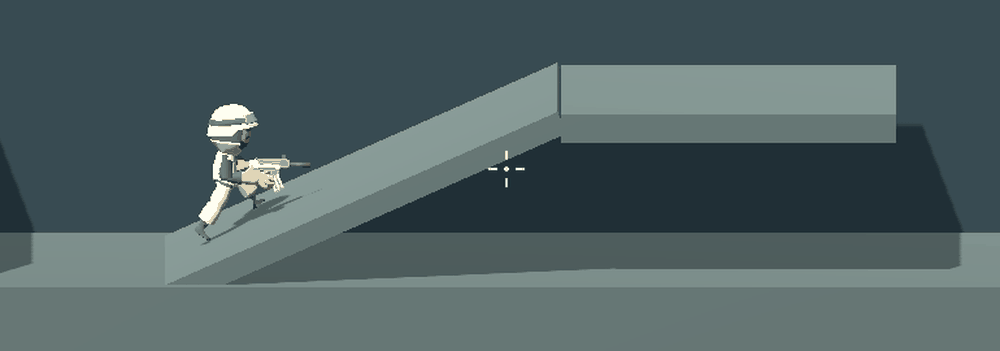
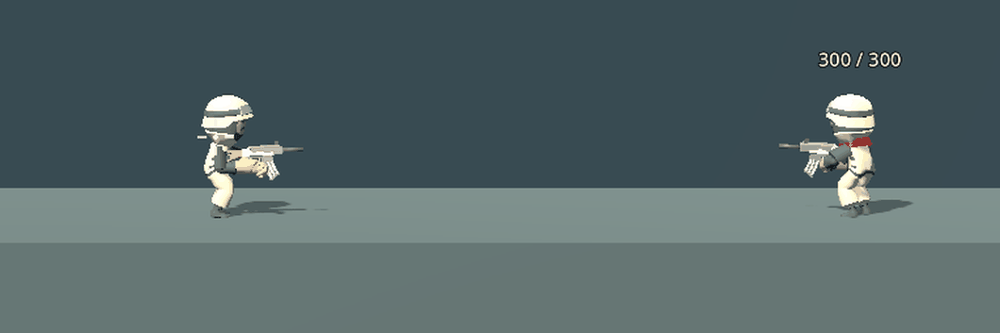
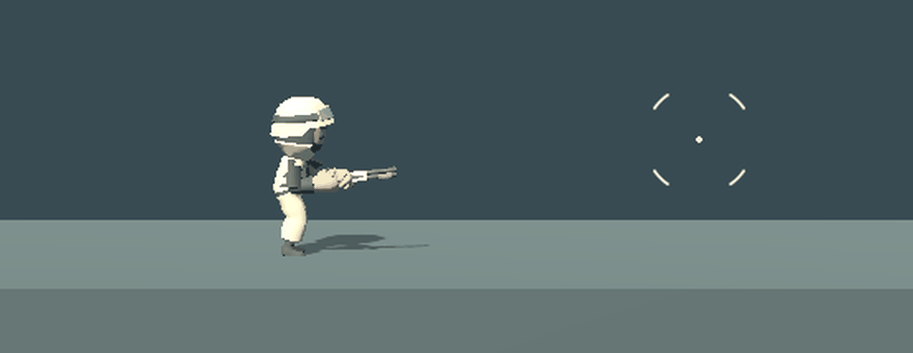
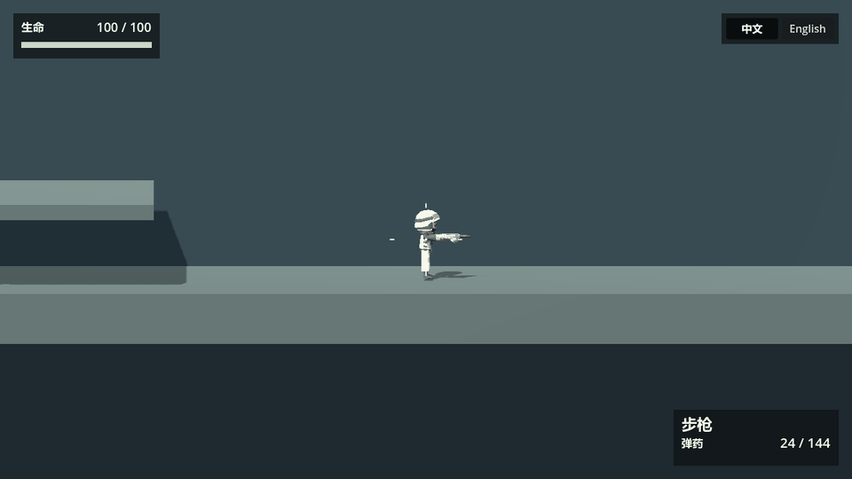
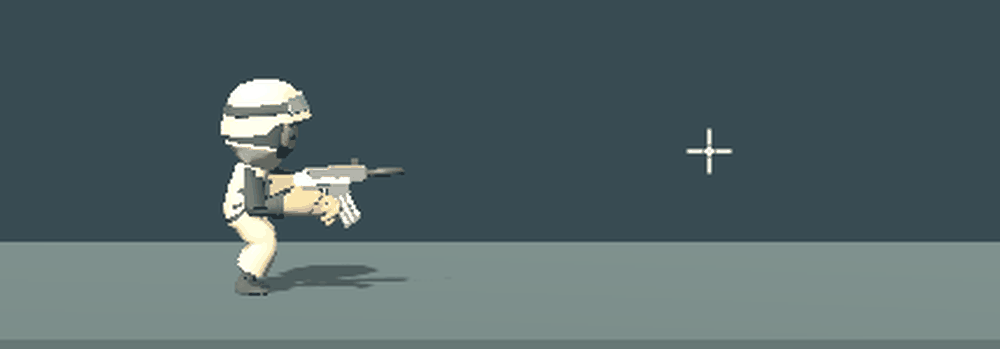

# BREACHLINE · 3C Side-scroller Demo

基于 **Godot 4.7.1** 的横向侧视、真实 3D 的 **Character / Camera / Control** 演示。保留角色移动与动画、斜坡和多层平台、镜头跟随、可配置步枪与霰弹枪，以及会巡逻、追击、射击和死亡的 NPC。工程采用 Jolt Physics 和 GL Compatibility，界面默认中文并支持英语。

**[在线试玩 / Play online](https://godot3dscrollingdemo.pages.dev/)** · 网页导出仅部署到 Cloudflare Pages，不提交到源码仓库。

|             Control 控制 · 基础控制             |             Control 控制 · 足部贴地             |           Character 角色 · NPC 对战           |
| :-----------------------------------------------: | :-----------------------------------------------: | :---------------------------------------------: |
|  |  |  |

|               Camera 镜头 · 动态准心               |                   Camera 镜头 · 瞄准偏移与阻尼                   |                Other 其他 · 枪口火光及动态准心                |
| :-------------------------------------------------: | :----------------------------------------------------------------: | :-------------------------------------------------------------: |
|  |  |  |

入口为 `scenes/gameplay/main.tscn`；`scenes/actors/` 组合玩家与 NPC，`scenes/weapons/` 保存枪械及特效，`scripts/` 实现行为，`resources/weapons/` 存放可编辑的枪械参数，`assets/` 存放演示引用的素材。

[3C 技术说明](Docus/3C.zh.md) · [English 3C notes](Docus/3C.en.md) · [MIT License](LICENSE) · [素材与许可 / Assets and licenses](Docus/ASSETS.md)

**English:** A compact, side-view 3D Character / Camera / Control demo with a ramp, two configurable guns, and combat NPCs. Original project content is MIT-licensed; third-party models and audio retain their CC0 terms. See the [English technical notes](Docus/3C.en.md).
